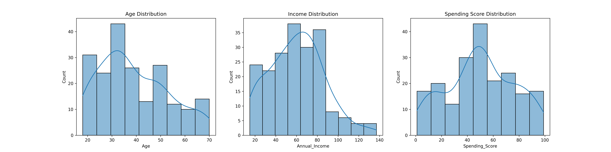
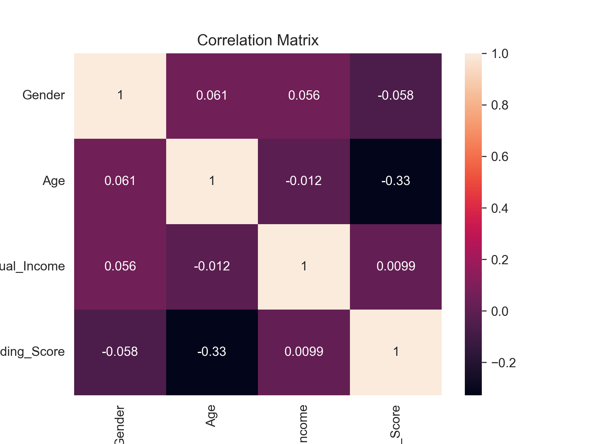
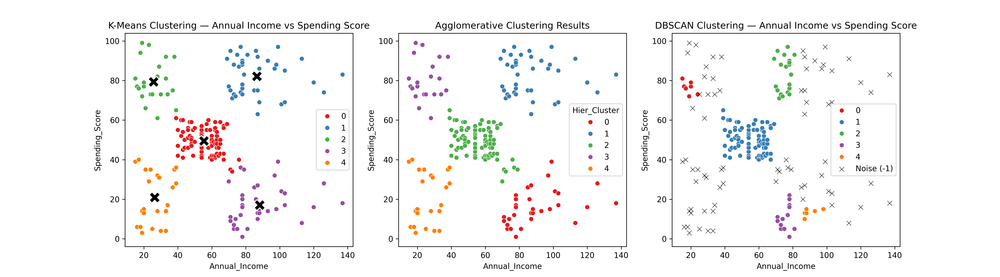

# Mall Customer Segmentation - Unsupervised Learning Project

[Project_Overview](https://drive.google.com/drive/folders/10NcWlPVNkTZO0mtHnCxU9CmaJDvOZdlA?usp=drive_link)

This project focuses on customer segmentation using unsupervised learning techniques applied to the **Mall Customer Segmentation Dataset**[cite: 2]. The goal is to identify distinct customer groups based on their demographic features and spending behaviors to assist mall management in designing targeted marketing strategies[cite: 2].

---

## 📌 Project Overview
* **Institute:** Red & White Skill Education[cite: 2]
* **Subject:** Unsupervised Learning[cite: 2]
* **Project:** Practical Report 1 (PR 1)[cite: 2]
* **Dataset:** Mall Customer Segmentation Data (Kaggle)[cite: 2]
* **Algorithms Implemented:** K-Means Clustering, Agglomerative Hierarchical Clustering, DBSCAN[cite: 2]

---

## 📊 Dataset Description
The dataset consists of **200 anonymized customer records** collected from a shopping mall[cite: 2]. It contains no missing values or duplicates, providing a clean structure for clustering analysis[cite: 2].

### Key Columns:
* `Gender`: Encoded as binary ($Male = 1, Female = 0$)[cite: 2].
* `Age`: Continuous numerical data representing the customer's age (18–70)[cite: 2].
* `Annual_Income`: Estimated annual income in thousands of USD (15–137)[cite: 2].
* `Spending_Score`: Mall-assigned score from 1 to 100 based on purchasing habits[cite: 2].

---

## 🛠️ Project Workflow

### Task 1: Data Loading & Exploratory Data Analysis (EDA)
* Loaded and verified data distribution characteristics[cite: 2].
* Renamed columns for standardized programming references and encoded `Gender`[cite: 2].
* Analyzed univariate histograms with KDE curves to understand marginal distributions[cite: 2].
* Generated pairplots and a correlation matrix to identify underlying structural variations[cite: 2].

### Task 2: Feature Engineering & Rationale
* Applied `StandardScaler` to `Age`, `Annual_Income`, and `Spending_Score`[cite: 2]. Distance-based models like K-Means and DBSCAN are highly sensitive to column magnitudes[cite: 2]; scaling prevents `Annual_Income` from skewing distances[cite: 2].
* Extracted a 2-feature subset (`Annual_Income` vs. `Spending_Score`) to capture distinct clusters and support intuitive 2D plotting without PCA[cite: 2].

### Task 3: K-Means Clustering
* Determined the optimal cluster count using the Elbow Method and Silhouette Analysis ($K=5$).
* Fitted the final model and plotted centroids with explicit indicators.
* Segmented customer characteristics via profiling tables to map out strategic actions.

### Task 4: Agglomerative Hierarchical Clustering
* Generated a hierarchical tree matrix utilizing **Ward Linkage** (which minimizes within-cluster variance).
* Evaluated optimal dendrogram thresholds and visualized cluster boundaries.
* Compared results side-by-side with K-Means to identify spatial agreements.

### Task 5: DBSCAN Clustering
* Performed parameter tuning by plotting sorted 4th-Nearest-Neighbor distances to pinpoint the curvature "knee" for epsilon estimation.
* Executed a parameter grid-search across multiple combinations of `eps` and `min_samples`.
* Configured the final DBSCAN architecture, explicit labeling, and separate handling for low-density anomalies marked as noise.

---

## 📈 Executive Optimization Report

### Part 1: Feature Scaling & Model Optimization Summary
* **Why StandardScaler is Required:** Distance-based algorithms like K-Means and DBSCAN rely strictly on Euclidean distance calculations. Without feature scaling, features with naturally larger raw magnitudes and variances (like `Annual_Income`, range ~15–137) completely dominate the distance formula over smaller-scale features (like `Spending_Score`, range 1–100), skewing cluster boundaries and mathematically blinding the model to spending behaviors.
* **Inertia and Optimal K Selection ($K = 5$):** Inertia (or Within-Cluster Sum of Squares) measures cluster tightness by calculating the total sum of squared distances from each data point to its assigned centroid. Plotting inertia against $K$ reveals an "elbow" at $K = 5$, representing the exact point of diminishing returns where adding more clusters no longer yields a significant drop in inertia, perfectly balancing model simplicity with structural density.

### Part 2: Algorithm Comparison & Shape Detection
* **Question 1: Explain how DBSCAN handles the requirement of specifying the number of clusters compared to K-Means.**
  * **Answer:** Unlike K-Means, which requires you to explicitly define the number of clusters ($K$) upfront, DBSCAN automatically infers the total number of clusters based strictly on the local spatial density of the data points. It groups points that are closely packed together and identifies sparse areas as boundaries, allowing the natural distribution of the data to dictate the final cluster count.
* **Question 2: Contrast the types of cluster shapes that DBSCAN and K-Means can detect.**
  * **Answer:** DBSCAN is highly versatile and can successfully identify and capture clusters of arbitrary, irregular geometric shapes because it forms clusters by chaining density-connected neighboring points. Conversely, K-Means minimizes global variance from a central point, which mathematically forces the model to assume that all clusters are spherical, circular, and highly symmetric around their centroids.
* **Question 3: How do DBSCAN and K-Means differ in their treatment of low-density or boundary points?**
  * **Answer:** DBSCAN dynamically labels low-density points that fail to satisfy its strict neighborhood parameters (`eps` and `min_samples`) as explicit noise, leaving outliers unassigned (`-1`) to keep core clusters dense. K-Means lacks any concept of noise or outliers, meaning it forces every single data point in the dataset into the nearest cluster, even if it severely distorts the cluster's boundary.
* **Question 4: On this dataset, do all three algorithms agree on the number of customer segments? Which segments are most stable across all three?**
  * **Answer:** Yes, K-Means, Agglomerative Hierarchical, and DBSCAN all structurally agree on a baseline of five distinct customer segments for this mall dataset. The most stable segments across all three methodologies are the four heavily isolated corner clusters—specifically the high-income groups and low-income groups—due to their dense structural packing and distinct spatial separation from the center.

### Part 3: Final Metrics & Deployment Recommendation
* **Algorithm Evaluation:** Evaluated using silhouette scores (excluding noise for DBSCAN), the models achieved approximately ~0.55 for K-Means, ~0.54 for Hierarchical, and a top score of **0.6173** for DBSCAN. DBSCAN performs best mathematically because it filters out muddy, low-density border points, allowing its core customer archetypes to remain highly cohesive and well-separated.
* **Deployment Recommendation:** For actual mall management deployment, **K-Means** is the recommended algorithm because it enforces 100% data coverage, ensuring that every single customer is successfully funneled into a targeted marketing strategy. While DBSCAN yields a higher silhouette score, it leaves 73 customers unclassified as "noise," which is less practical for a marketing team that aims to engage and retain the entire customer base.

---

## 💼 Business Insights for Mall Management

### 1. Customer Segment Analysis (K-Means Results)

Based on the highly interpretable K-Means clustering model ($K=5$), the mall's customer base is divided into five distinct consumer groups. Their profiles and recommended marketing activations are outlined below:

* **The Middle Ground (Average Income, Moderate Spenders)**
  * **Description:** This segment represents middle-aged individuals (~43 years old) with balanced characteristics: a moderate annual income (~$55k) and an average spending score (~50). They form a stable, consistent foundation of the mall's foot traffic.
  * **Targeted Marketing Action:** Enroll them in mainstream general loyalty reward programs and deploy weekend family-centric community events, casual dining bundles, and promotions tied to mid-tier anchor department stores.

* **VIPs / Premium Targets (High Income, High Spenders)**
  * **Description:** A highly lucrative, younger demographic (~33 years old) characterized by robust purchasing power (high income of ~$87k) paired with an explicit desire to buy (spending score of ~82). 
  * **Targeted Marketing Action:** Implement premium customer retention strategies. Offer customized luxury loyalty perks, early access to new designer collections, complimentary valet parking, private boutique personal shopper invitations, and fine-dining experiential rewards.

* **Impulsive / Trendy Shoppers (Low Income, High Spenders)**
  * **Description:** This cohort consists of very young adults (~25 years old) who possess limited personal financial backing (low income of ~$26k) but maintain an extraordinarily active purchasing habit (high spending score of ~79). They are highly brand-conscious and trend-driven.
  * **Targeted Marketing Action:** Deploy aggressive, digitally active social media flash campaigns. Partner with fast-fashion retailers for pop-up micro-events, launch student discount days, and construct interactive, aesthetic mall installations tailored for social media engagement.

* **Untapped Potential (High Income, Low Spenders)**
  * **Description:** A middle-aged cluster (~41 years old) possessing significant financial capital (high income of ~$88k) but demonstrating minimal engagement with mall retail channels (spending score of ~17). They represent a major missed revenue opportunity.
  * **Targeted Marketing Action:** Shift the marketing narrative away from discounts toward "convenience, utility, and elite quality." Send personalized showcases highlighting premium electronics, high-end fitness clubs, health/wellness spaces, or specialty artisanal service options available on-site.

* **Frugal Shoppers (Low Income, Low Spenders)**
  * **Description:** Comprising mature adults (~45 years old), this segment exhibits low financial flexibility (income of ~$26k) along with highly disciplined, minimal consumption patterns (spending score of ~21).
  * **Targeted Marketing Action:** Focus strictly on value-driven, utility marketing. Funnel targeted alerts featuring essential grocery multi-buys, end-of-season clearance blowouts, dollar-store values, or free community-focused health and entertainment programs.

---

## 📈 Visualizations Breakdown

### Exploratory Data Analysis & Distribution Summary

* **Age:** The customer base peaks around 30-35 years, showing a strong segment of active young consumers.
* **Income:** Follows a well-distributed curve centering between \$50k–\$80k, with a long tail representing elite high earners.
* **Spending Score:** Displays a significant, massive concentration around the 40–50 score mark.

### Features Relationship & Interaction Profiles

* Features exhibit very weak linear correlations, guaranteeing independent structural information.
* The only notable negative correlation lies between `Age` and `Spending_Score` ($-0.33$), verifying that younger shoppers dominate high-spending behavior.

### Algorithmic Comparison Benchmark


* **K-Means:** Strongly splits data space globally into circular partitions around five balanced anchors.
* **Hierarchical:** Perfectly replicates K-Means boundaries across dense groupings but alters definitions slightly at ambiguous boundary lines.
* **DBSCAN:** Successfully extracts arbitrary cores by discarding sparse transitional points into explicit black noise cross-markers (`-1`).

---

## 📂 Repository Contents
* `UL_PR1.ipynb`: Full Jupyter Notebook containing structured markdown headers, code blocks, and execution steps.
* `UL_PR1.html`: Exported HTML version of the notebook for static viewing.
* `requirements.txt`: Python package dependencies with verified version listings.
* `/figure/`: Folder containing all extracted charts and benchmark plots.

---

## 🚀 How to Reproduce
1. Clone this repository to your local system environment.
2. Install the required dependencies via pip:
   ```bash
   pip install -r requirements.txt
